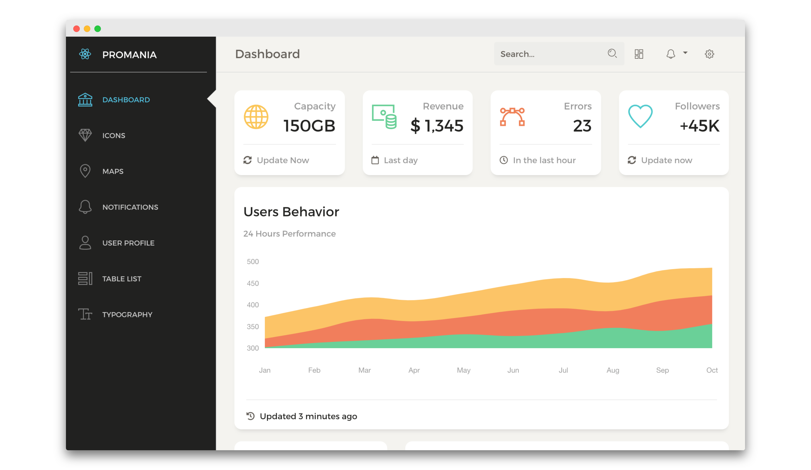
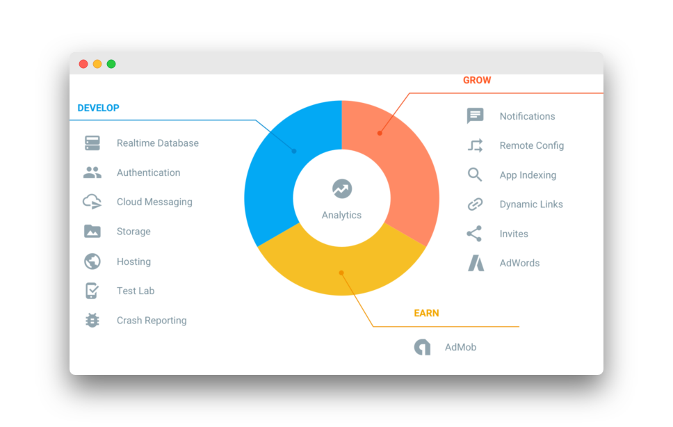
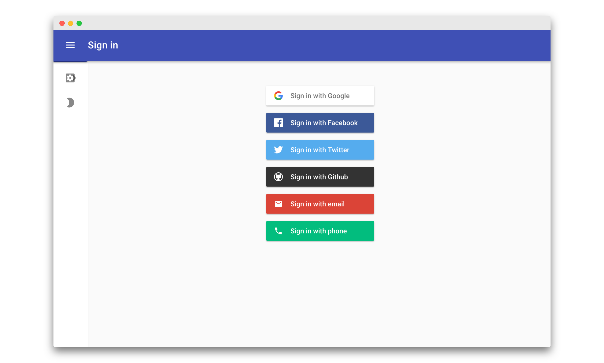
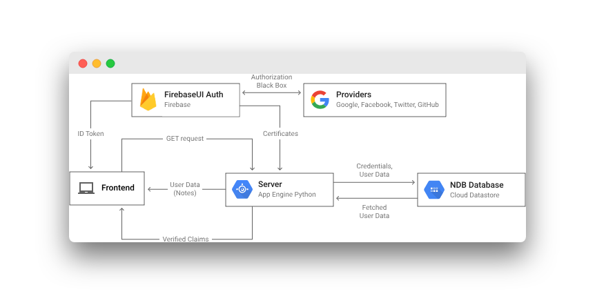
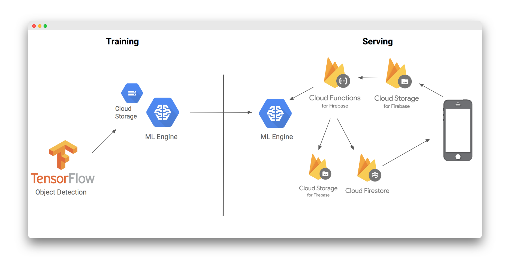
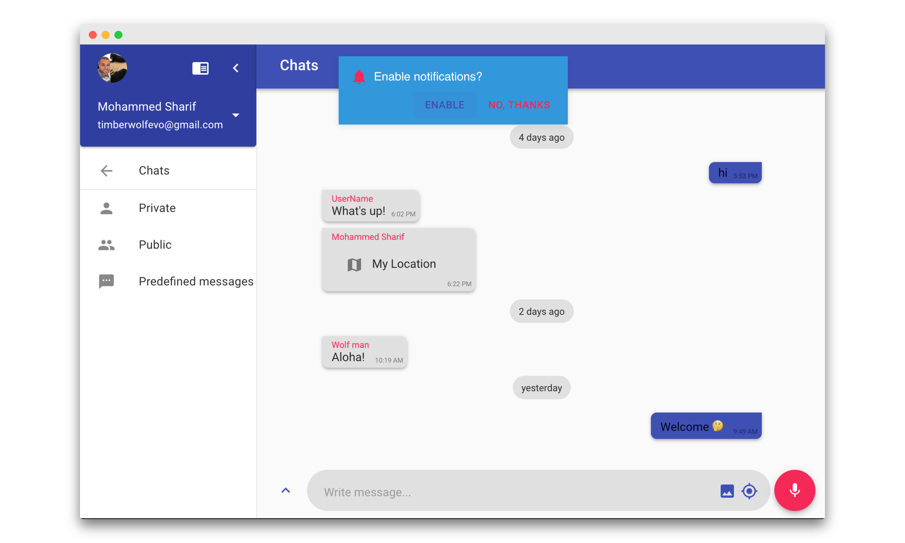
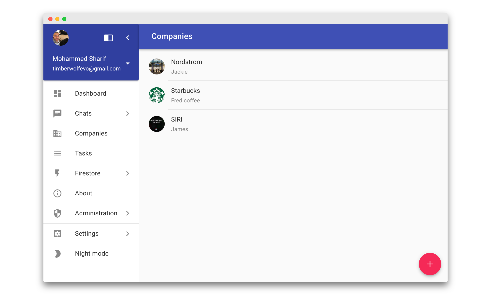
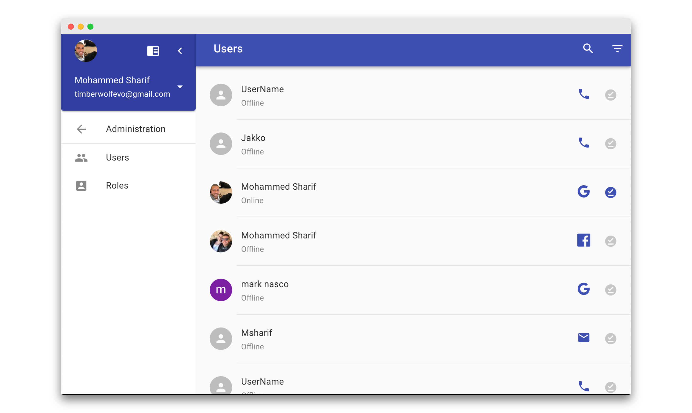

# ‌‌ [![LOGO][logo-image]][logo-url] Promania
[![Build Status][travis-image]][travis-url]
[![Dependency Status][daviddm-image]][daviddm-url]
[![License][license-image]][license-url]
[![Code Style][code-style-image]][code-style-url]

## What is this?

Promania is a social platform built on today's most cutting edge web technologies and best practices to deliver high performance web software and smooth user experience across all devices. 

* Promania is a boilerplate project that uses react, redux and firebase. It has all "Most Wanted" features you need for a full functional Progressive Web Application. The best part is that it is based on to main parts:

* CRA - Create React App which is a very minimalistic boilerplate for react projects but with all webpack, babel and other tools and libraries setup for you. It is maintained by a great team from Facebook
rmw-shell - The part that goes further than CRA. This one has all the main parts that a new application needs. The best about it is that it gets updated even when you have started your new project and added new parts to it. That way we can ensure that all projects get the needed updates.

## Top Features

* Material UI
* Code splitting
* Redux implementation
* Firebase to redux sync
* Authentication
* Authorization
* Push notifications UI integration
* Theming
* Internationalization
* Build in CI (Continues Integration)
* Build in CD (Continues Deployment)
* Realtime forms

## Progressive Web application (PWA)

Progressive - Works for every user, regardless of browser choice because it's built with progressive enhancement as a core tenet.
Responsive - Fits any form factor: desktop, mobile, tablet, or whatever is next.
Connectivity independent - Enhanced with service workers to work offline or on low-quality networks.
App-like - Feels like an app, because the app shell model separates the application functionality from application content.
Fresh - Always up-to-date thanks to the service worker update process.
Safe - Served via HTTPS to prevent snooping and to ensure content hasn't been tampered with.
Discoverable - Is identifiable as an "application" thanks to W3C manifest and service worker registration scope, allowing search engines to find it.
Re-engageable - Makes re-engagement easy through features like push notifications.
Installable - Allows users to add apps they find most useful to their home screen without the hassle of an app store.
Linkable - Easily share the application via URL, does not require complex installation.

## Firebase Cloud Authentication

Firebase Authentication is the he recommended way to add a complete sign-in system to your app.

FirebaseUI provides a drop-in auth solution that handles the UI flows for signing in users with email addresses and passwords, phone numbers, and with popular federated identity providers, including Google Sign-In and Facebook Login.

The FirebaseUI Auth component implements best practices for authentication on mobile devices and websites, which can maximize sign-in and sign-up conversion for your app. It also handles edge cases like account recovery and account linking that can be security sensitive and error-prone to handle correctly.

FirebaseUI can be easily customized to fit in with the rest of your app's visual style, and it is open source, so you aren't constrained in realizing the user experience you want.

## Firebase Cloud Hosting

Firebase Hosting is production-grade web content hosting for developers. With a single command, you can quickly and easily deploy web apps and serve both static and dynamic content to a global content delivery network (CDN).

## Firebase Cloud Functions

Firebase Functions is a hosted, private, and scalable Node.js environment where you can run JavaScript code. [Cloud Functions for Firebase](https://firebase.google.com/features/functions) integrates the Firebase platform by letting you write code that responds to events and invokes functionality exposed by other Firebase features.

## Firebase Cloud Storage

Firebase Cloud Storage is a powerful, simple, and cost-effective object storage service built for Google scale. The Firebase SDKs for Cloud Storage add Google security to file uploads and downloads for your Firebase apps, regardless of network quality. You can use our SDKs to store images, audio, video, or other user-generated content. On the server, you can use Google Cloud Storage, to access the same files.

## Firebase Realtime Database

Firebase Realtime Database is a cloud-hosted database. Data is stored as JSON and synchronized in realtime to every connected client. When you build cross-platform apps with our iOS, Android, and JavaScript SDKs, all of your clients share one Realtime Database instance and automatically receive updates with the newest data.

## Material UI Design

Material design is a single system which acts as the unified resource among the devices of different size like Laptop, Mobile devices etc. It also makes use of the transitions, padding, depth-effects like shadows.

Google’s Material Design considers “material” as a homogeneous digital fabric in which the material responds according to the user interaction . It provides the certain design standards for developing application across android , web and ios devices.

## Machine Learning

ML Kit is a mobile SDK that brings Google's machine learning expertise to Android and iOS apps in a powerful yet easy-to-use package. Whether you're new or experienced in machine learning, you can implement the functionality you need in just a few lines of code. There's no need to have deep knowledge of neural networks or model optimization to get started. On the other hand, if you are an experienced ML developer, ML Kit provides convenient APIs that help you use your custom TensorFlow Lite models in your mobile apps.

## Screenshots

## License

MIT

[logo-image]: ./img/promania.png
[logo-url]: https://github.com/Mosh-Media/react-firebase/blob/master/README.md
[travis-image]: https://travis-ci.org/Mosh-Media/promania-platform.svg?branch=master
[travis-url]: https://travis-ci.org/Mosh-Media/promania-platform
[daviddm-image]: https://img.shields.io/david/Mosh-Media/react-firebase.svg?style=flat-square
[daviddm-url]: https://david-dm.org/Mosh-Media/react-firebase
[license-image]: https://img.shields.io/npm/l/express.svg
[license-url]: https://github.com/Mosh-Media/react-firebase/master/LICENSE
[code-style-image]: https://img.shields.io/badge/code%20style-standard-brightgreen.svg?style=flat-square
[code-style-url]: http://standardjs.com/

